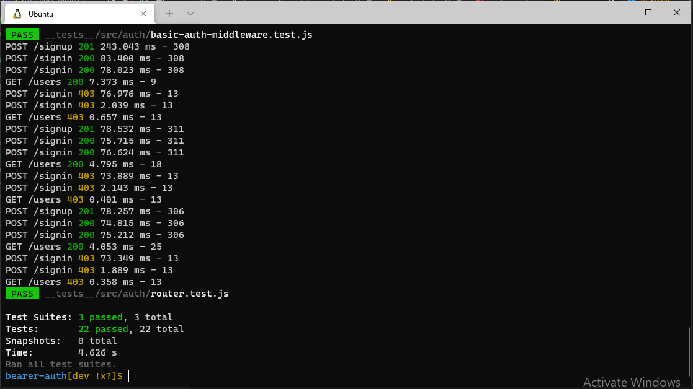
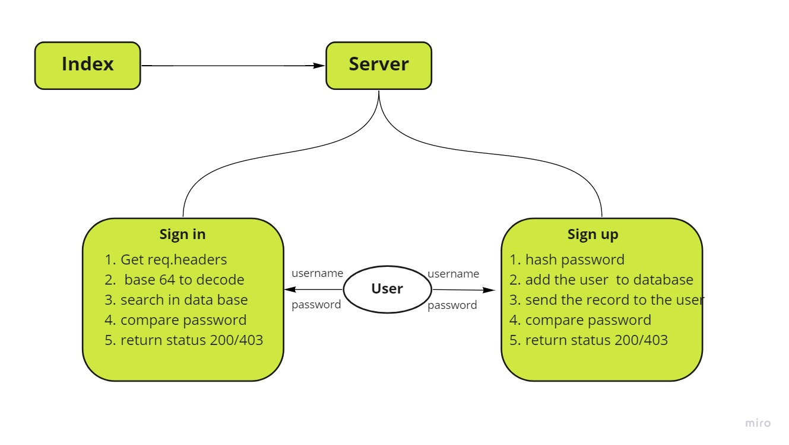

# Bearer Auth

### An Authentication Server, has various end points that performs sign in, sign up, users and secret.
****
### End Points
*  /signin : POST Method
   You can Signin by sending post request using postman.
    https://bearer-auth-enas.herokuapp.com/signin (login)

*  /signup : POST Method
   You can Signup by sending post request using postman.
    https://bearer-auth-enas.herokuapp.com/signup (creat)

* /users : GET Method
Enter the 'token', and send GET request using postman.
https://bearer-auth-enas.herokuapp.com/users  

* /secret : GET Method
Enter the 'token', and send GET request using postman.
https://bearer-auth-enas.herokuapp.com/secret  
****

## Deployment

### [Heroku](https://bearer-auth-enas.herokuapp.com/) 
### [Action](https://github.com/En-ZUH/bearer-auth/actions)
### [Pull Requests](https://github.com/En-ZUH/bearer-auth/pulls)

****
## Testing

***

### UML Diagram

